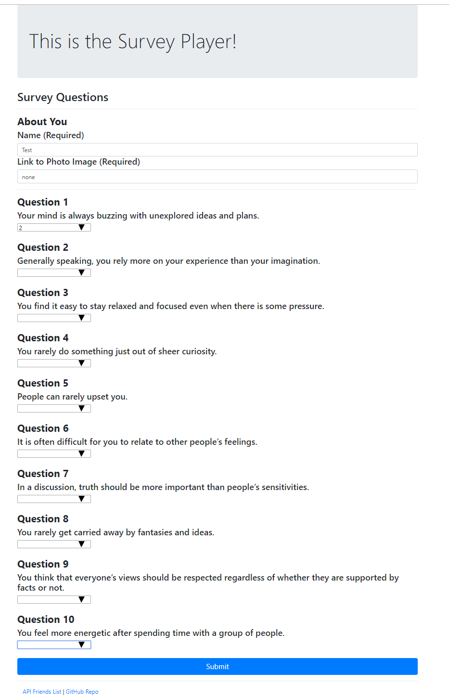
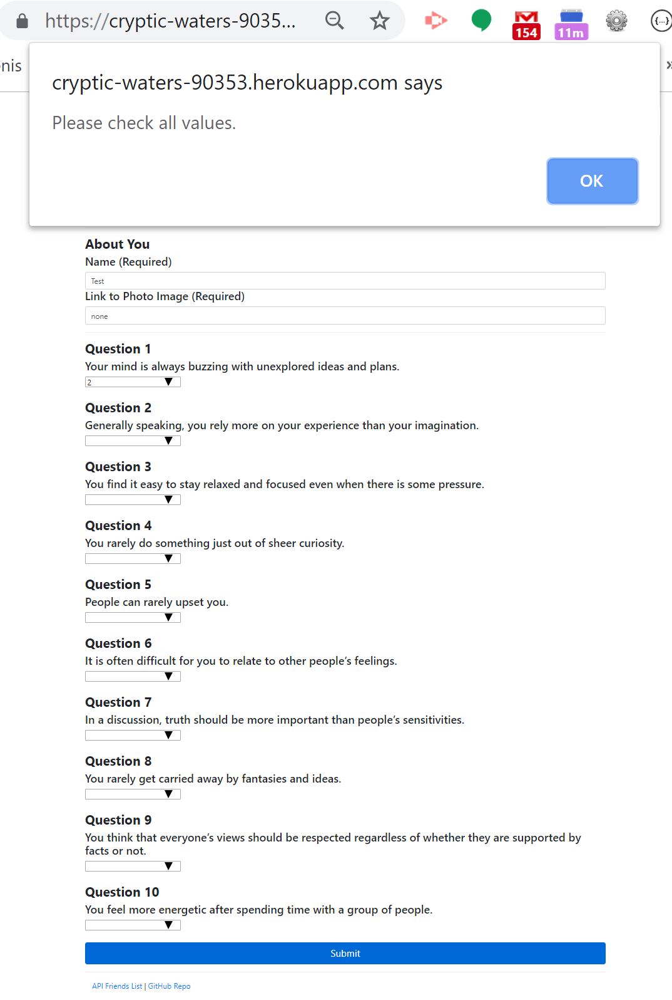
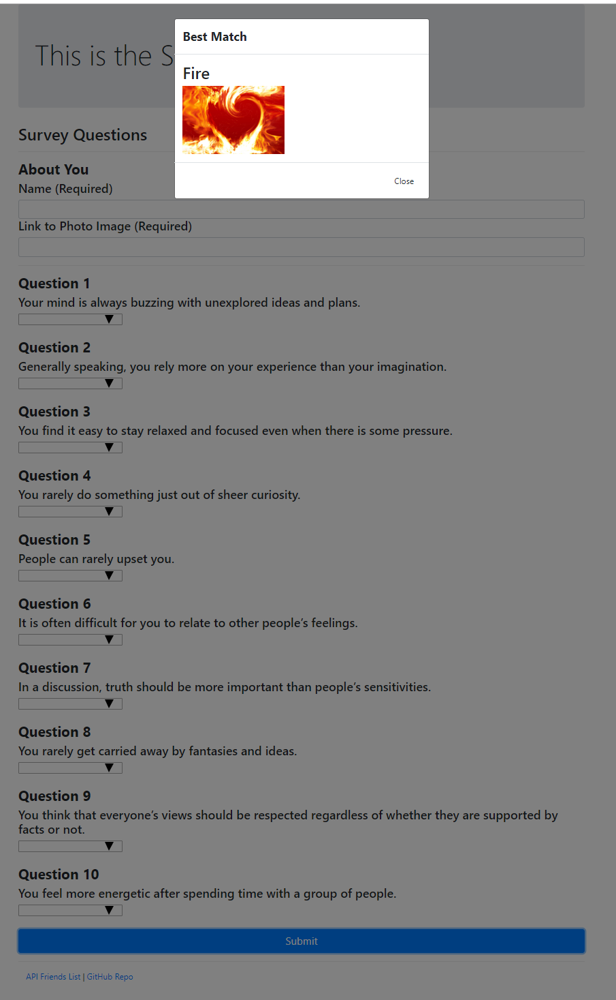

# Friend Finder - Node and Express Servers
---
### Overview

  ## A compatibility-based "FriendFinder" application -- basically a dating app. This full-stack site will take in results from the users' surveys, then compare their answers with those from other users. The app will then display the name and picture of the user with the best overall match.
  
  [Link to App](https://cryptic-waters-90353.herokuapp.com/survey)
---
### How the app works:

* 1. A survey with 10 questions. Each answer is a scale of 1 to 5 based on how much the user agrees or disagrees with a question.

* 2. `htmlRoutes.js` file includes two routes:

   * A GET Route to `/survey` which displays the survey page.
   * A default, catch-all route that leads to `index.html` which displays the home page.
---

* 3. `apiRoutes.js` file contains two routes:

   * A GET route with the url `/api/friends`. This will be used to display a JSON of all possible friends.
   * A POST routes `/api/friends`. This will be used to handle incoming survey results. This route will also be used to handle the compatibility logic.

* 4. The application's data inside of `app/data/friends.js` is saved as an array of objects.

* 5. The closest match will be the user with the least amount of difference.

* 6. The current user's most compatible friend is displayed as a modal pop-up,
   * which has both the name and picture of the closest match.
   ---
